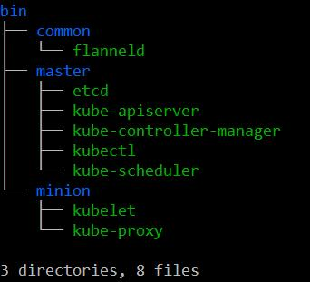

# Kubernetes安装与使用

## Kubernetes简介

官网的介绍：“Kubernetes is an open source platform for automating deployment, scaling, and operations of application containers across clusters of hosts.”

Kubernetes脱胎于Google内部的大规模集群管理工具Borg，并且Kubernetes项目早期的主要贡献者正是参与过Borg项目的工程师。简单地说，Kubernetes是一个管理跨主机容器化应用的系统，实现了包括部署、高可用管理和弹性伸缩在内的一系列基础功能并封装成为一套完整、简单易用的RESTful API对外提供服务。Kubernetes的设计哲学之一就是维护应用容器集群一直处于用户所期望的状态，为了践行这一价值观，Kubernetes建立了一套健壮的集群自恢复机制，包括容器的自动重启和自动重调度等。

## Kubernetes安装

### 实验环境

Kubernetes master 节点：

* 192.168.23.30 master

Kubernetes minion 节点：

* 192.168.23.31 node1
* 192.168.23.32 node2
* 192.168.23.33 node3

以上四个节点是CentOS7的Vbox虚拟机，使用vagrant管理。

### 准备工作

1. [Etcd](https://coreos.com/etcd/docs/latest/)：存储Kubernetes和flannel的信息。
2. [Flannel](https://github.com/coreos/flannel)：overlay网络，实现集群中docker容器间的访问。
3. [Kubernetes](http://kubernetes.io/v1.1/)

以上服务都是由Go语言开发的，因此直接获取相关的二进制文件即可。

### 安装

笔者提供了安装脚本(适用于有systemd服务的环境)，省去了手动安装配置的麻烦。由于二进制文件太大，因此没有添加在项目中，请自行获取并以下图结构添加到bin目录下。



无参数运行脚本输出帮助信息：
```
./install.sh
Usage: ./install.sh [options]...

options:
  --type,-t <master|minion>            in master node, it will be installed the etcd, kube-apiserver, kube-controller-manager, kube-scheduler and flannel
                                       in minion(default) node, it will be installed the kubelet, kube-proxy and flannel
  --etcd-servers,-e <etcd servers>     list the etcd servers, like: http://etcd:4001
  --master,-m <master server>          the kubernetes cluster master server, like: http://master:8080
  --help,-h                            display help text
```
在所有节点上运行此脚本即可安装配置Kubernetes集群，并运行相关服务启动Kubernetes集群。需要先在master节点上安装，master节点上同时运行一个etcd服务(-e 参数指定服务接口)，如果minion节点未安装docker-engine，此脚本也会自动安装。

如果需要配置proxy接入internet，在install.sh同级目录下的install.conf文件中配置PROXY。若使用私有的docker仓库，在install.conf中配置REGISTRY，并将其地址信息配置给NO_PROXY。

### 查看集群状态

在master上运行kubectl get node:
```
kubectl get node
NAME      LABELS                         STATUS    AGE
node1     kubernetes.io/hostname=node1   Ready     2d
node2     kubernetes.io/hostname=node2   Ready     2d
node3     kubernetes.io/hostname=node3   Ready     2d
```

## Kubernetes使用

Kubernetes官方的文档非常全面，在这里就不做过多赘述了，主要贴出使用前需要了解的信息和快速入门的链接(不生产文档，只作文档的搬运工)。这里只贴出了一部分，其它文档在了解了基础使用之后根据需要自行参阅，建议前4个根据顺序了解，后面三个在第4篇文档看完并实践之后参阅。

1. [Appication Administration Overview and Concepts](http://kubernetes.io/v1.1/docs/user-guide/README.html)
2. Key Concepts:[Pods](http://kubernetes.io/v1.1/docs/user-guide/pods.html), [Labels and Selectors](http://kubernetes.io/v1.1/docs/user-guide/labels.html), [Replication Controller](http://kubernetes.io/v1.1/docs/user-guide/replication-controller.html) and [Services](http://kubernetes.io/v1.1/docs/user-guide/services.html)
3. [Quick Start](http://kubernetes.io/v1.1/docs/user-guide/quick-start.html)
4. [Guestbook Example](http://kubernetes.io/v1.1/examples/guestbook/README.html)
5. [CLI Reference Overview](http://kubernetes.io/v1.1/docs/user-guide/kubectl-overview.html)
6. [Detailed Walkthrough](http://kubernetes.io/v1.1/app-admin-detailed.html)
7. [Tips and Tricks when working with config](http://kubernetes.io/v1.1/app-admin-detailed.html)

